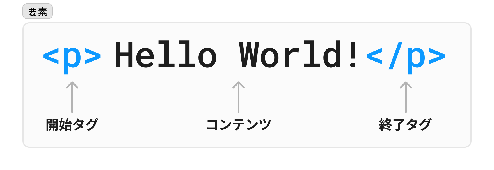

# 1. HTMLの基礎

## 1.1 HTMLとは

HTML（HyperText Markup Language）は、Webページを構成するコンテンツの構造を記述するためのマークアップ言語です。[^1]
コンテンツには、たとえば文章・画像・リンク・段落などがあります。これをブラウザが理解できる形で記述するためにHTMLを使用します。

> [!IMPORTANT]
> 繰り返しになってしまいますが、**HTMLはあくまでもコンテンツの構造を記述するための言語です。**
>
> コンテンツの見た目の記述にはCSSという別の言語を使用します。(第3回以降で扱います)

[^1]: このため、HTMLはプログラミング言語ではありません。[詳しくはこちら](./a1_programing_and_markup.md)

## 1.2 HTMLの基本構造

### 1.2.1 要素

HTMLはたくさんの「要素」を組み合わせて記述します。この要素には普通のテキストや「タグ」と呼ばれるもので囲ったものを使ったりします。

「タグ」を使うことで、ブラウザに対して「この部分は画像です」「この部分は段落です」のように伝えることができます。

具体的な「要素」の例を見てみましょう。たとえば、「Hello World!」という文字を表示することを考えます。

---

例1はもっとも単純に表示した例です。これはプレーンテキストと呼ばれるもので、単純に文字を表示するだけです。

例1: Plain Text

```html
Hello World!
```

---

では、「Hello World!」を段落として表示したい場合はどうすればよいでしょうか？ この場合、ブラウザに「Hello World!」という文字列を段落として表示するように指示する必要があります。

そこで、タグを使います。タグを使った要素は例2のような形式で記述します。

例2: Element with Tag


開始タグと終了タグを使って、「このタグで囲まれたコンテンツはこういう意味です」とブラウザに伝えることができます。<br>
上の例では「Paragraph(段落)」を指すpタグを使っているので、ブラウザは「Hello World! という文字列を段落として表示すればいいんだな」と理解して表示してくれます。

---

また、要素の中にはプレーンテキストだけではなく別の要素を入れることもできます。

たとえば、「Hello World!」という段落の中で「Hello」という単語を強調して表示したい場合は、例3で示すように「Hello」を`<strong>`要素のコンテンツとして含めると良いです。

例3: Nested Element

```html
<p><strong>Hello</strong> World!</p>
```

> [!CAUTION]
> 開始タグと終了タグは必ずペアで記述する必要があります。開始タグだけを記述したり、終了タグだけを記述することはできません。
>
> また、下のように開始タグと終了タグが対応していないと構文エラーとなります。
>
> 構文エラーになる例1
>
> ```html
> <p>Hello World!</strong>
> ```
>
> 構文エラーになる例2
>
> ```html
> <p><strong>Hello</p> World!</strong>
> ```

### 1.2.2 属性

HTMLタグには属性と呼ばれるものをつけることができます。例えば、先程の「Hello World!」段落内の文字を赤色にしたい場合、例4のように`style`属性を使って指定することができます。このとき、`style`を属性名、`color: red;`を属性値と呼びます。

また、属性値に文字列を指定する場合は両端にダブルクオート(`"`)をつけることを忘れないでください。(忘れると構文エラーになります。)

例4: Element with Attribute


> [!TIP]
> 例4で記述した`<style>`属性はCSSを記述する方法のひとつです。詳しくは第3回以降で扱います。

## 1.3 実際のHTMLを読んでみよう

では、実際にWebページを構成するHTMLを見てみましょう。HTMLファイルは拡張子が`.html`であることが一般的です。

[part-2/practice/template.html](../practice/template.html)に一般的なテンプレートとして利用できるHTMLを用意しました。

このHTMLファイルをVSCodeで開いたとき、右上のアイコン部分に目のマークのボタンがあると思います。(下の画像で左から3つめのボタン)<br>
このボタンをクリックすると、今開いているHTMLを実際にVScode内に表示させることができます。以降、この機能を使いながらHTMLを書く演習をしていきます。


※もし「プレビュー」ボタンが表示されない場合は、[ここ](https://marketplace.visualstudio.com/items?itemName=ms-vscode.live-server)から拡張機能をインストールしてください。

---
さて、`template.html`は表示できたでしょうか。**真っ白なページが表示されていれば正常です。**<br>
`template.html`は空のファイルではないのになぜブラウザでは何も表示されないのでしょうか？

```html
<!doctype html>
<html lang="ja">
  <head>
    <meta charset="UTF-8" />
    <meta name="viewport" content="width=device-width, initial-scale=1.0" />
    <title>Hello World!</title>
  </head>
  <body></body>
</html>
```

このHTMLファイルは以下のような構造になっています。

- `<!doctype html>`: **HTML文書を書く際必ず必要な前置き。** <br>これを書くことで、このHTMLファイルの形式は現在広く使われているHTML Living Standardであるということをブラウザに伝えます。<br>詳しい説明は[MDNで読めます。](https://developer.mozilla.org/ja/docs/Glossary/Doctype)
- `<html>`: HTML文書のルート要素。Webページを構成する要素すべてをこの要素の中に記述します。<br>また、`lang`属性はこのHTML文書の言語を指定します。ブラウザの自動翻訳機能などで利用されます。
- `<head>`: ページの機械的な情報を記述するための要素。この中にはページのタイトルなど、ページ内には表示されないがブラウザに伝えたい情報を記述します。
<br>たとえば`<title>`要素はページのタイトルを指定します。ブラウザ上ではタイトルはこのように表示されます。<br>
- `<meta>`: ページのメタデータを記述するための要素。<br>たとえば`<meta charset="UTF-8" />`はこのHTML文書の文字コードがUTF-8であることを指定しています。<br>`<meta name="viewport" content="width=device-width, initial-scale=1.0" />`については第3回で触れます。
- `<body>`: ページのコンテンツを記述するための要素。この中に`<p>`などのWebページの表示内容を表す要素を記述します。

## 1.4 理解度チェック

Q. 以下のHTML文書のうち、正しいものを選んでください。

1.<br>

  ```html
  <!doctype html>
  <html>
  <head>
    <p>
      Hello World!
    </p>
  </head>
  <body></body>
  </html>
  ```

2.<br>

```html
<!doctype html>
<html>
  <head></head>
  <body>
    <title>Hello World!</title>
    <p>
      Hello World!
    </p>
  </body>
</html>
```

3.<br>

```html
<!doctype html>
<html>
  <head>
    <title>Hello World!</title>
  </head>
  <body>
    <p>
      Hello World!
    </p>
  </body>
</html>
```

4.<br>

```html
<!doctype html>
<html>
  <head>
    <title>Hello World!</title>
  </head>
 <body>
    <p>
      Hello World!
      </body>
  </p>
</html>
```

<details>
  <summary>1. が解答だと思ったらクリック</summary>
   間違いです。head要素内にpのようなページコンテンツを表す要素を記述することはできません。
</details>

<details>
  <summary>2. が解答だと思ったらクリック</summary>
   間違いです。body要素内にtitleのようなページの機械的情報を表す要素を記述することはできません。
</details>

<details>
  <summary>3. が解答だと思ったらクリック</summary>
   正解です。よくできました！
</details>

<details>
  <summary>4. が解答だと思ったらクリック</summary>
   間違いです。よく見るとpタグとbodyタグの開始 / 終了タグの対応が取れていません。<br>このHTMLは構文エラーになります。
</details>

さて、駆け足になってしまいましたがHTMLの基本的な構造を理解できたでしょうか？

それでは実際にHTMLを書いてみましょう。
